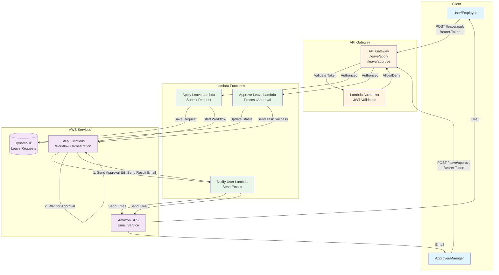

# Leave Management System

A serverless leave management system built with AWS SAM, Step Functions, and TypeScript.

## 🏗️ Architecture Diagram


## 📋 Features

- ✅ **JWT Authentication** - Secure API with custom Lambda authorizer
- ✅ **Leave Application** - Employees can apply for leave
- ✅ **Approval Workflow** - Step Functions orchestrates approval process
- ✅ **Email Notifications** - Automated emails via SES
- ✅ **Role-Based Access** - Employee and Approver roles
- ✅ **DynamoDB Storage** - Serverless database for leave records
- ✅ **CI/CD Pipeline** - GitHub Actions for automatic deployment
- ✅ **API Documentation** - Swagger/OpenAPI specification

## 🚀 Technology Stack

- **Language**: TypeScript
- **Runtime**: Node.js 18.x
- **Infrastructure**: AWS SAM (Serverless Application Model)
- **Services**:
  - AWS Lambda (Compute)
  - API Gateway (REST API)
  - DynamoDB (Database)
  - Step Functions (Workflow)
  - SES (Email)
- **Testing**: Jest
- **CI/CD**: GitHub Actions

## 📂 Project Structure
```
leave-management-npl/
├── src/
│   ├── lambdas/
│   │   ├── applyLeave/         # Submit leave request
│   │   ├── approveLeave/       # Approve/reject leave
│   │   ├── auth/               # JWT authentication
│   │   └── notifyUser/         # Send email notifications
│   ├── stepfunctions/
│   │   └── leaveWorkflow.asl.json  # Step Functions definition
│   └── shared/
│       ├── types.ts            # TypeScript types
│       └── utils.ts            # Utility functions
├── tests/
│   └── unit/                   # Jest unit tests
├── .github/
│   └── workflows/
│       └── deploy.yml          # GitHub Actions CI/CD
├── template.yaml               # SAM template
├── swagger.yaml                # API documentation
└── package.json
```

## 🔄 Workflow

1. **Employee applies for leave** → API Gateway → Apply Leave Lambda
2. **Save to DynamoDB** with status `PENDING`
3. **Start Step Functions workflow**
4. **Send email to approver** via SES
5. **Wait for approval** (up to 24 hours)
6. **Approver approves/rejects** → API Gateway → Approve Leave Lambda
7. **Update DynamoDB** with new status
8. **Send result email to employee** via SES

## 🛠️ Setup Instructions

### Prerequisites

- Node.js 18.x or higher
- AWS CLI configured
- AWS SAM CLI installed
- Git

### Installation

1. **Clone the repository**
```bash
   git clone <your-repo-url>
   cd leave-management-npl
```

2. **Install dependencies**
```bash
   npm install
```

3. **Run tests**
```bash
   npm test
```

4. **Build the project**
```bash
   sam build
```

5. **Deploy to AWS**
```bash
   sam deploy --guided
```

### AWS SES Setup

Before deployment, verify your email in AWS SES:

1. Go to AWS Console → SES
2. Click "Verified identities"
3. Click "Create identity"
4. Verify your email address
5. Update `SENDER_EMAIL` in `template.yaml`

## 🔑 Authentication

Generate JWT tokens for testing:
```javascript
const jwt = require('jsonwebtoken');

const user = {
  userId: 'user123',
  email: 'john@example.com',
  name: 'John Doe',
  role: 'employee' // or 'approver'
};

const token = jwt.sign(user, 'your-jwt-secret', { expiresIn: '24h' });
console.log(token);
```

## 📡 API Endpoints

### Apply for Leave
```bash
POST /leave/apply
Authorization: Bearer <JWT_TOKEN>

{
  "startDate": "2026-02-01",
  "endDate": "2026-02-05",
  "reason": "Family vacation",
  "approverEmail": "manager@company.com"
}
```

### Approve/Reject Leave
```bash
POST /leave/approve
Authorization: Bearer <JWT_TOKEN>

{
  "leaveId": "1736014234567-abc123xyz",
  "action": "approve",  // or "reject"
  "taskToken": "AAAAKgAAAAIAA..."
}
```

## 🧪 Testing

Run all tests:
```bash
npm test
```

Run tests in watch mode:
```bash
npm run test:watch
```

## 🚢 Deployment

### Manual Deployment
```bash
sam build
sam deploy
```

### Automatic Deployment (GitHub Actions)

Push to `main` or `dev` branch:
```bash
git add .
git commit -m "Deploy leave management system"
git push origin main
```

GitHub Actions will automatically:
1. Run tests
2. Build the application
3. Deploy to AWS

## 📊 Monitoring

- **CloudWatch Logs**: View Lambda execution logs
- **X-Ray**: Trace requests through the system
- **Step Functions Console**: Monitor workflow executions

## 🔒 Security

- JWT-based authentication
- IAM roles with least privilege
- API Gateway authorization
- Encrypted data at rest (DynamoDB)
- Encrypted data in transit (HTTPS)

## 📝 License

MIT License

## 👨‍💻 Author

Naveen - Leave Management System

## 🤝 Contributing

Contributions are welcome! Please feel free to submit a Pull Request.